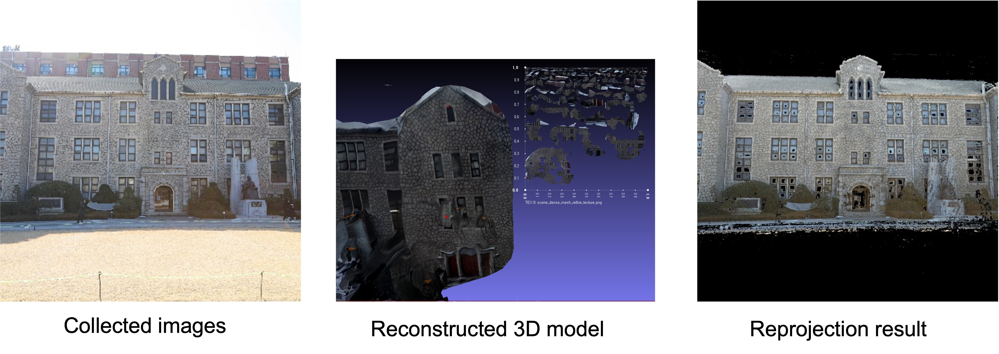

# PointCloud2Image

Mapping the point cloud of the 3D model to the corresponding image

Following model params are stored in my external SSD

- model
- pinhole_cam_params
- refined_cam_params
- visualsfm_cam_params
- simvsfm_cam_params
- fixed_cam_params

# Result

